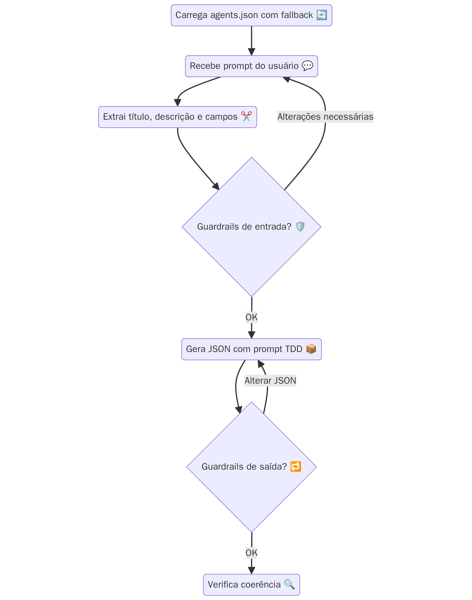

# Agent Flow TDD

<p align="center">
  
</p>

Framework para desenvolvimento orientado a testes usando agentes de IA.

## 🔍 Visão Geral

O Agent Flow TDD utiliza modelos de IA para auxiliar no desenvolvimento orientado a testes, gerando código, testes e documentação com base em prompts. O framework suporta múltiplos modelos de IA, tanto locais quanto remotos, e oferece uma interface de linha de comando simples para interação.

## 🚀 Início Rápido

```bash
# Clone o repositório
git clone https://github.com/Malnati/agent-flow-tdd.git
cd agent-flow-tdd

# Instale as dependências
make install

# Execute um exemplo
make tdd prompt="Criar API REST em Python" format=json
```

## 📚 Documentação

A documentação completa está disponível no diretório [docs/](docs/):

- **[Visão Geral](docs/overview/README.md)** - Arquitetura e tecnologias
- **[Instalação](docs/installation/README.md)** - Requisitos e configuração
- **[Uso](docs/usage/README.md)** - Comandos e exemplos
- **[Modelos](docs/examples/model-examples.md)** - Exemplos de uso com diferentes modelos
- **[Troubleshooting](docs/troubleshooting/README.md)** - Solução de problemas

## 🔧 Principais Comandos

```bash
# Gerar código/testes a partir de um prompt
make tdd prompt="Criar sistema de login" format=json

# Especificar modelo
make tdd prompt="Implementar ordenação" model=deepseek_local format=python

# Visualizar logs
make logs

# Executar testes
make test

# Publicar pacote (requer token PyPI)
make publish
```

## 🤖 Modelos Suportados

### Locais (Offline)
- `tinyllama-1.1b` - TinyLLaMA (1.1B)
- `phi1` - Microsoft Phi-1 (1.3B)
- `deepseek_local` - DeepSeek Coder (6.7B)
- `phi3` - Microsoft Phi-3 Mini

### Remotos (API)
- `gpt-3.5-turbo`, `gpt-4-turbo` - OpenAI
- `claude-3-opus`, `claude-3-sonnet` - Anthropic
- `gemini-pro` - Google

## 🛠️ Problemas Conhecidos e Soluções

### Problema com `python -m build` no Makefile
Se você encontrar problemas ao executar `make publish` devido a falhas no comando `python -m build`, você pode:

1. Executar os comandos de build manualmente no terminal:
   ```bash
   python -m build
   python -m twine upload dist/* --username __token__ --password $PYPI_TOKEN
   ```

2. Ou modificar o Makefile para usar `$(SHELL)` em vez de `bash -c`:
   ```make
   @$(SHELL) -c "$(PYTHON) -m build"
   ```

### Outros Problemas Comuns

Consulte a seção de [Troubleshooting](docs/troubleshooting/README.md) para mais informações sobre outros problemas comuns e suas soluções.

## 🤝 Contribuindo

Contribuições são bem-vindas! Veja [CONTRIBUTING.md](CONTRIBUTING.md) para mais detalhes.

## 📝 Licença

Este projeto está licenciado sob a licença MIT - veja o arquivo [LICENSE](LICENSE) para detalhes.